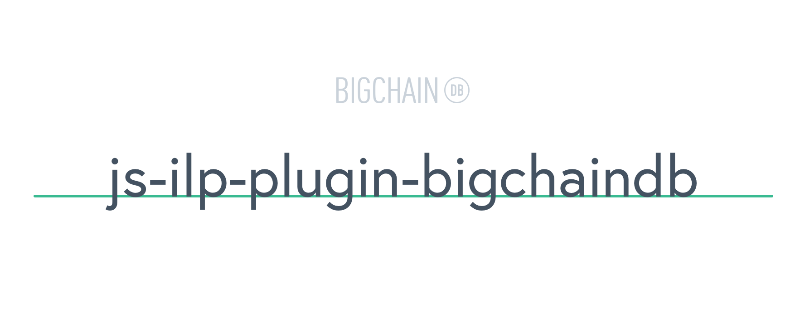

# [](https://www.bigchaindb.com)

> ILP ledger plugin for [BigchainDB](https://github.com/bigchaindb/bigchaindb)

[](https://www.npmjs.com/package/ilp-plugin-bigchaindb)
[](https://github.com/ascribe/javascript)

## Installation

```bash
npm install ilp-plugin-bigchaindb
```

## Usage

Depending on your build system and preferences, you can use any of the following exports:

### CommonJS (default package export)

```js
const BigchainDBLedgerPlugin = require('ilp-plugin-bigchaindb')
```

### ES6 modules

```js
import BigchainDBLedgerPlugin from 'ilp-plugin-bigchaindb/es6'
```

### Bundled version (UMD export)

Add `/bundle/bundle.min.js` to your HTML and use `window.BigchainDBLedgerPlugin`:

```html
<script src="/bundle/bundle.min.js"></script>

<script>
    window.BigchainDBLedgerPlugin;
</script>
```

## npm releases

For a new **patch release**, execute on the machine where you're logged into your npm account:

```bash
npm run release
```

Command is powered by [`release-it`](https://github.com/webpro/release-it) package, defined in the `package.json`.

That's what the command does without any user interaction:

- create release commit by updating version in `package.json`
- create tag for that release commit
- push commit & tag
- create a new release on GitHub, with change log auto-generated from commit messages
- publish to npm as a new release

If you want to create a **minor** or **major release**, use these commands:

```bash
npm run release-minor
```

```bash
npm run release-major
```

## License

```
Copyright 2017 BigchainDB GmbH

Licensed under the Apache License, Version 2.0 (the "License");
you may not use this file except in compliance with the License.
You may obtain a copy of the License at

   http://www.apache.org/licenses/LICENSE-2.0

Unless required by applicable law or agreed to in writing, software
distributed under the License is distributed on an "AS IS" BASIS,
WITHOUT WARRANTIES OR CONDITIONS OF ANY KIND, either express or implied.
See the License for the specific language governing permissions and
limitations under the License.
```